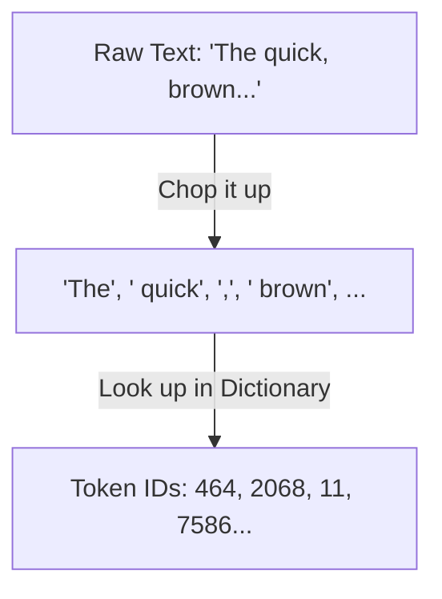

# Chapter 2.1 - Tokenizing Text

<Callout type="info" title="Overview">
Tokenization is the very first step. It is how we convert human-readable text into small, structured pieces (like syllables or words) that a computer program can understand.
</Callout>

---


## 🎯 Why we do it
<Callout type="info" title="Rationale">
Artificial intelligence models and neural networks cannot read raw letters. They only understand math and numbers. We tokenize text to chop it up into smaller pieces, and then we use a dictionary (called a [[#^vocab|vocabulary]]) to assign a unique number to every single piece.
</Callout>

## 🛠️ How we do it
<Callout type="info" title="Methodology">
We use a tool called a [[#^tokenizer|tokenizer]] (specifically, [[#^bpe|Byte Pair Encoding or BPE]]). It acts like a smart dictionary that breaks down rare words into smaller chunks and keeps common words whole.
</Callout>

## 📥 Input
<Callout type="info" title="Input Format">
- **Description:** A regular text string, exactly as a human would write or read it. This will be our master example sentence.
</Callout>
>
> - **Example:** 
> ```python
> text = "The quick, brown fox jumps over the lazy dog!"
> ```

## 📤 Output
<Callout type="info" title="Resulting State">
- **Description:** A simple list of numbers (a 1-dimensional [[#^tensor|tensor]]). Each number directly corresponds to a specific text piece from our vocabulary dictionary.
</Callout>
>
> - **Example:** 
> ```python
> tensor([464, 2068, 11, 7586, 21831, 11687, 625, 262, 16931, 3290, 0])
> ```
> 
> **Token Mapping Example:**
> 
> | Token ID | What it means |
> | :---: | :---: |
> | `464` | "The" |
> | `2068` | " quick" |
> | `11` | "," |
> | `7586` | " brown" |
> | `21831`| " fox" |

## ⚙️ Working
<Callout type="info" title="Under the Hood">
1. The tokenizer looks at the raw sentence.
2. It chops the sentence up based on spaces, punctuation, and common word fragments.
3. It looks up each fragment in the vocabulary and swaps it out for its ID number.


</Callout>

---

## 📖 Terminologies

- **Vocabulary:** A dictionary that assigns a unique number to every single piece of text. ^vocab
- **Tokenizer:** A tool that breaks down text into smaller pieces called tokens. ^tokenizer
- **Byte Pair Encoding (BPE):** A smart tokenizer algorithm that breaks down rare words into smaller chunks while keeping common words whole. ^bpe
- **Tensor:** A container for mathematical data; a 1-dimensional tensor is essentially a simple list of numbers. ^tensor
