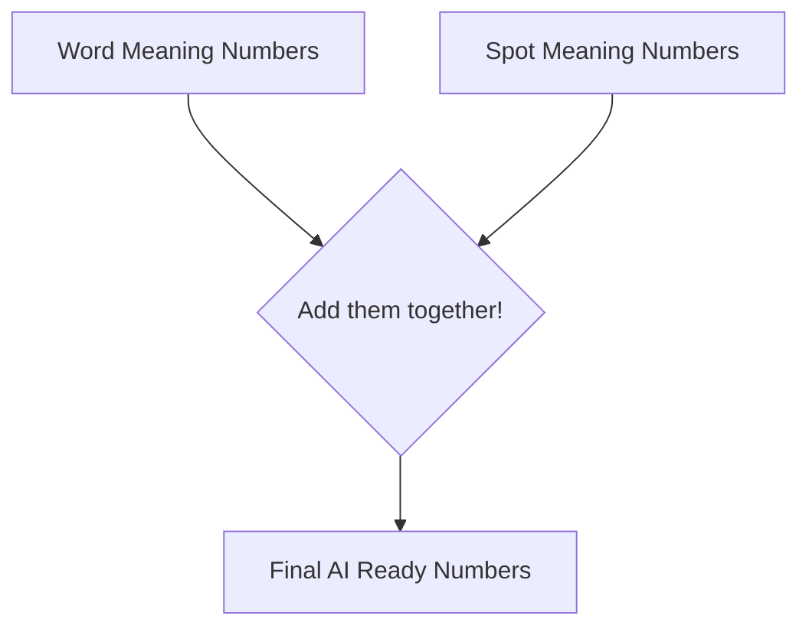

# Chapter 2.4 - Encoding Positional Embeddings


<Callout type="info" title="Overview">
Positional embeddings are how we teach the AI the order of words in a sentence, giving it a sense of time and sequence.
</Callout>

---

## 🎯 Why we do it
<Callout type="info" title="Rationale">
The AI reads every word in a sentence at the exact same time. It has no idea what order they are in! To the AI, "The dog bit the man" and "The man bit the dog" look completely identical. To fix this, we create a second set of embeddings that just represent "Position 1", "Position 2", etc., and we blend them together with the word meanings.
</Callout>

## 🛠️ How we do it
<Callout type="info" title="Methodology">
We create another lookup table (just like in the previous chapter), but instead of looking up word IDs, we look up position numbers (0, 1, 2, 3...). We grab the decimal numbers for the word's meaning, grab the decimal numbers for the word's position, and simply add them together!
</Callout>

## 📥 Input
<Callout type="info" title="Input Format">
- **Description:** A simple list counting up, representing the position of each word in the sequence. For our master sentence "The quick, brown fox...", we need positions for all words.
</Callout>
>
> - **Example:** 
> ```python
> positions = tensor([0, 1, 2, 3, 4]) # For the first 5 tokens
> ```

## 📤 Output
<Callout type="info" title="Resulting State">
- **Description:** A 3D block of decimal numbers, shaped as `(Batch Size, Sequence Length, Embedding Size)`. This looks just like the output from Chapter 3, but now the numbers contain BOTH the meaning of the word AND its location in the sentence.
</Callout>
>
> - **Example:** 
> ```python
> final_embeddings = token_embeddings + position_embeddings
> ```
> 
> **Blending them together (For the word "The" at Spot 0):**
> 
> | Where the numbers come from | Value 1 | Value 2 | Value 3 |
> | :--- | :---: | :---: | :---: |
> | **Word Meaning (ID 464: "The")** | 0.12 | -0.45 | 0.88 |
> | **Position Meaning (Spot 0)** | 0.05 | 0.10 | -0.02 |
> | **Final Blended Result**| **0.17** | **-0.35** | **0.86** |

## ⚙️ Working
<Callout type="info" title="Under the Hood">
1. Look up the meaning of the word in the Token Embedding table.
2. Look up the meaning of the spot it sits in using the Position Embedding table.
3. Add the two lists of numbers together like simple math.


</Callout>
